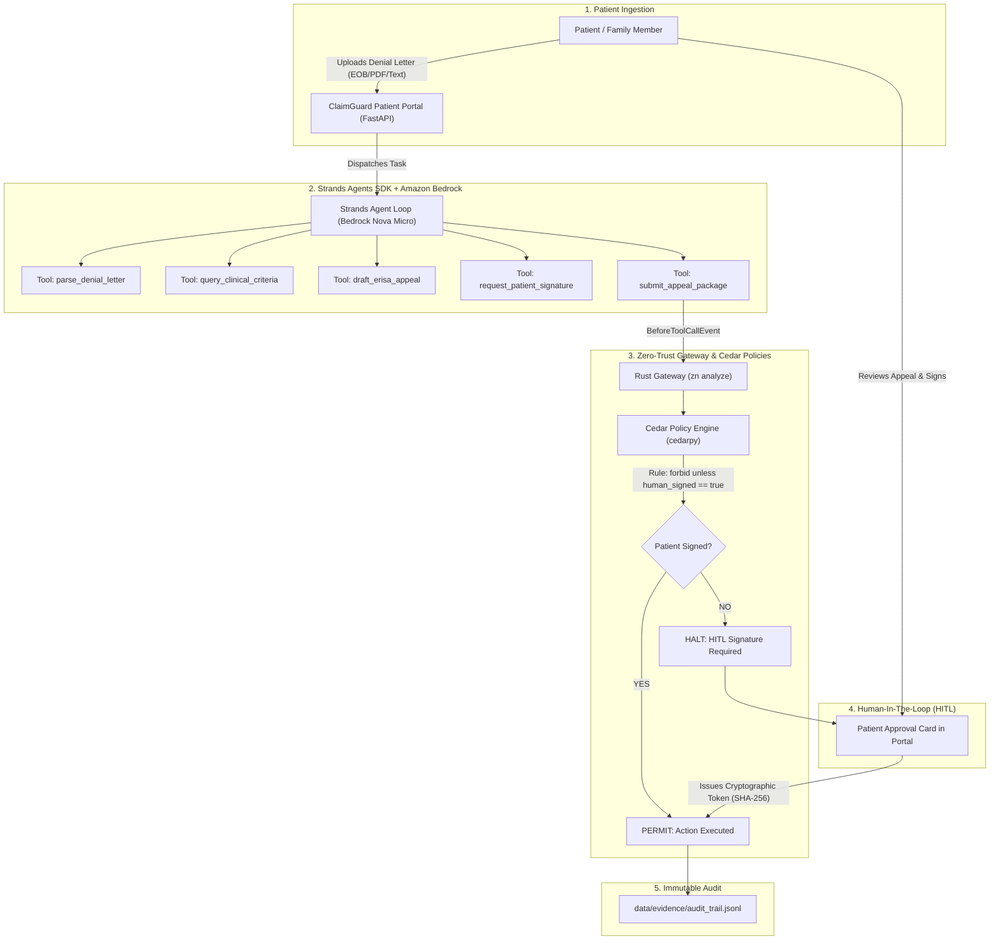

# ClaimGuard: Architectural Blueprint & System Design

**Project:** ClaimGuard (The Autonomous Medical Claim & Prior-Auth Patient Advocate)  
**Hackathon:** AWS "Agents for Humans" (Everyday Agents / Good Neighbor Track)  
**Core Technologies:** Strands Agents SDK, Amazon Bedrock (Nova Micro / Claude 3.5 Sonnet), AgentCore Runtime, Cedar Policies (`cedarpy`), Rust Deterministic Safety Gateway (`zn`), FastAPI.

---

## 1. Executive Summary & The Human Mission

In the United States, healthcare insurers deny **12% to 18% of prior authorization requests**, issuing over **49 million claim denials annually**. Insurers increasingly rely on bulk-denial algorithms (e.g., Cigna PxDx, UnitedHealth NaviHealth) that reject claims in as little as 1.2 seconds without meaningful physician review.

Concurrently:
- **Over $220 Billion in medical debt** hangs over American families.
- **99.8% of denied patients never appeal** because the process is deliberately complex, requiring CPT/ICD-10 clinical coding, medical necessity guidelines, and statutory filings under ERISA.
- Yet, when formal appeals are filed with clinical evidence and legal citations, **between 60% and 90% of denials are overturned**.

**ClaimGuard** levels the playing field. It is an autonomous patient advocate agent that:
1. **Ingests & Deciphers Denial Letters (EOBs)**: Extracts claim numbers, procedure codes (CPT), diagnosis codes (ICD-10), billed amounts, and statutory deadlines (180 days under ERISA).
2. **Retrieves Clinical Guidelines**: Cross-references CMS National Coverage Determinations (NCDs) and commercial medical necessity criteria.
3. **Drafts Statutory ERISA § 503 Appeal Packages**: Generates legally binding, medically rigorous appeal packages citing 29 C.F.R. § 2560.503-1.
4. **Enforces Zero-Trust Patient Protection (Cedar Policies)**:
   - **HIPAA Privacy Gate**: Hard-blocks any tool call transmitting unredacted Protected Health Information (PHI) to external networks.
   - **Patient In-The-Loop (HITL) Gate**: Strictest enforcement—the agent CANNOT legally or technically submit an appeal without explicit patient cryptographic sign-off.
5. **Immutable Audit Vault**: Every step, evidence citation, and approval signature is cryptographically hashed (SHA-256) into a tamper-proof audit trail.

---

## 2. System Architecture & Component Interaction



---

## 3. Data Models & Schemas

### A. `DenialInfo`
```json
{
  "denial_id": "DEN-2026-0842",
  "patient_name": "Sarah Jenkins",
  "insurer": "Cigna HealthCare",
  "claim_number": "CLM-99214-X",
  "date_of_service": "2026-08-10",
  "denial_date": "2026-08-28",
  "cpt_code": "72148",
  "cpt_description": "MRI Lumbar Spine without Contrast",
  "icd10_code": "M54.5",
  "icd10_description": "Low back pain with radiculopathy",
  "billed_amount_cents": 485000,
  "denial_reason": "Medical necessity not established; failure to document 6 weeks conservative therapy.",
  "erisa_deadline_days": 180,
  "filing_deadline_date": "2027-02-24"
}
```

### B. `ClinicalGuideline`
```json
{
  "cpt_code": "72148",
  "guideline_source": "CMS LCD L34220 / Milliman Care Guidelines",
  "indications_met": [
    "Radiculopathy with neurological deficit unresponsive to conservative care",
    "Conservative therapy documented > 6 weeks OR severe acute deficit"
  ],
  "precedent_citations": [
    "Cigna v. Am. Medical Ass'n (ERISA Full and Fair Review standard)",
    "29 C.F.R. § 2560.503-1(h)(2)(iv) (Right to review all clinical files)"
  ]
}
```

### C. `AppealPackage`
```json
{
  "appeal_id": "APP-2026-0842",
  "denial_id": "DEN-2026-0842",
  "statutory_basis": "ERISA Section 503 (29 U.S.C. § 1133) & 29 C.F.R. § 2560.503-1",
  "clinical_summary": "Patient presented with documented 8-week physical therapy failure and acute L5-S1 nerve root compression.",
  "legal_demands": [
    "Immediate reversal of adverse benefit determination",
    "Provision of full claim file including reviewer credentials under 29 CFR § 2560.503-1(h)(2)(iii)"
  ],
  "appeal_letter_markdown": "# FORMAL FIRST-LEVEL ERISA APPEAL...",
  "human_signed": false,
  "signature_sha256": null
}
```

---

## 4. Cedar Policies Specification (`src/policies/policies.cedar`)

```cedar
// 1. Permit non-destructive research and drafting tools
permit(principal, action in [
    Action::"parse_denial_letter",
    Action::"query_clinical_criteria",
    Action::"draft_erisa_appeal",
    Action::"request_patient_signature"
], resource);

// 2. Strict Patient Gate: forbid final appeal submission unless cryptographically signed by patient
forbid(principal, action == Action::"submit_appeal_package", resource)
unless {
    resource.human_signed == true &&
    resource.days_until_deadline >= 0
};

// 3. HIPAA Privacy Gate: forbid transmitting unredacted patient SSN or raw identifiers
forbid(principal, action, resource)
when {
    context.phi_unredacted == true
};
```

---

## 5. Strands Agents SDK Toolset (`src/tools.py`)

1. `@tool parse_denial_letter(raw_text: str) -> str`:
   Uses Bedrock to structure the insurer denial, extracting CPT, ICD-10, denial reason, and deadline.
2. `@tool query_clinical_criteria(cpt_code: str, diagnosis: str) -> str`:
   Searches local CMS/NCD medical guidelines database for clinical necessity criteria.
3. `@tool draft_erisa_appeal(denial_json: str, clinical_guidelines_json: str, patient_notes: str) -> str`:
   Drafts a 2-page formal appeal package with clinical citations, doctor evidence, and federal statutory demands.
4. `@tool request_patient_signature(appeal_id: str, appeal_draft: str) -> str`:
   Publishes an approval card to the patient portal, creating a pending HITL record.
5. `@tool submit_appeal_package(appeal_id: str, recipient_fax_or_portal: str, signature_token: str) -> str`:
   The protected action gated by Cedar and the Rust Gateway. Checks `_has_approved_signature(appeal_id, signature_token)`.

---

## 6. Verification Criteria
- 100% automated test coverage in `tests/` (unit + integration + Cedar policy checks).
- Sub-second deterministic policy enforcement via `cedarpy`.
- Interactive patient portal running on FastAPI with zero mock regex in production agent loop.
