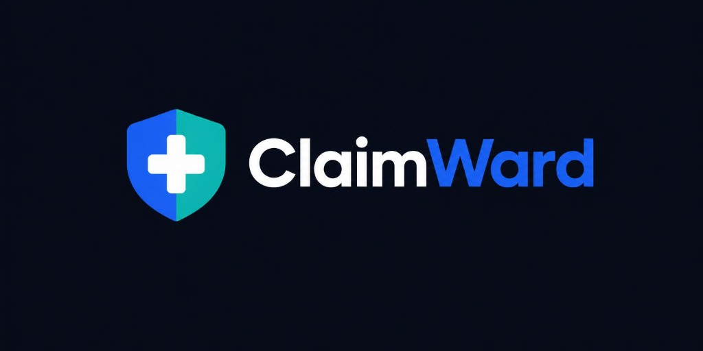
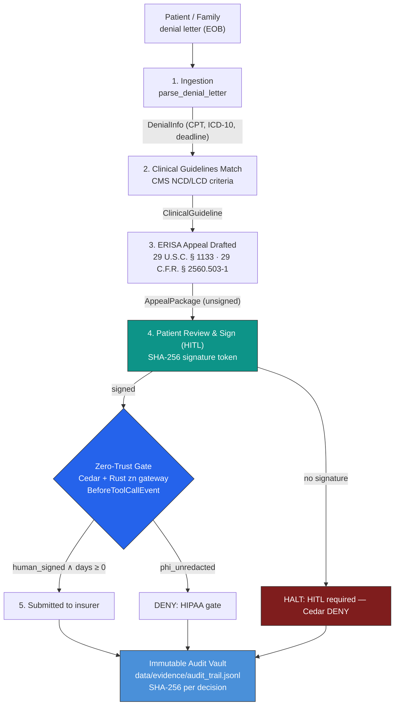

**🔗 Live Demo: [claimward.usezn.com](https://claimward.usezn.com)**

# ClaimWard — The Autonomous Patient Advocate

> **Researches clinical guidelines, drafts the formal ERISA § 503 appeal, and never submits a single word without the patient's cryptographic signature.**

🎥 **Video demo:** *coming — see VIDEO_SCRIPT.md* · 🌐 **Run locally:** 60-second Quickstart below

     

**Track:** Everyday Agents / Good Neighbor, *Agents for Humans* hackathon

---

## The Problem: The Denial Machine — and Why 99.8% of Patients Give Up

American families are being crushed by a system that denies care by algorithm:

| The Pain | The Number |
|---|---|
| 💸 **Medical debt crisis** | **$220 billion** in medical debt hangs over US households |
| 📉 **Algorithmic denials** | **49 million claim denials per year**; insurers deny 12–18% of prior authorizations |
| ⚡ **1.2-second rejections** | Cigna's PxDx and UnitedHealth's NaviHealth bulk-reject claims with no physician review (ProPublica investigation) |
| 😶 **The appeal gap** | **99.8% of denied patients never appeal** — the process demands CPT/ICD-10 coding, clinical-necessity criteria, and statutory filings under ERISA |
| 🎯 **The injustice** | Yet **60–90% of appealed denials are overturned**. The evidence was always there. The fight is just too hard to fight alone. |

The appeal letter that wins is a *legal document wrapped around a clinical argument*: cite 29 U.S.C. § 1133 (ERISA § 503), demand the reviewer's credentials under 29 C.F.R. § 2560.503-1(h)(2)(iii), cite the CMS LCD or specialty-society criteria the denial ignored. Stressed families have neither the codes, the citations, nor the energy.

**And they cannot hand the job fully to an AI** — an appeal is a sworn medical statement bearing their name. Unsupervised, an agent could submit something wrong, or transmit unredacted health identifiers. So ClaimWard is built on a rule as strict as the law it cites:

**The agent can do everything except the one thing only the patient may do: sign.**

---

## The Solution

ClaimWard is an autonomous patient advocate agent built with the **Strands Agents SDK** and **Amazon Bedrock**:

1. **Deciphers the denial letter** — extracts claim number, CPT/ICD-10 codes, billed amount, denial reason, and the 180-day ERISA filing deadline.
2. **Retrieves the clinical standard** — matches the denied procedure against CMS NCD/LCD and specialty-society medical-necessity criteria and finds the exact criteria the insurer's own logic must meet.
3. **Drafts the formal appeal** — a 2-page statutory package citing ERISA 29 U.S.C. § 1133 and 29 C.F.R. § 2560.503-1, with the guideline criteria, the treating-physician's documented facts, and three concrete legal demands.
4. **Holds the Human-in-the-Loop gate** — submission is **Cedar-forbidden** until the patient reviews the letter in the portal and cryptographically signs it (SHA-256 token bound to the exact draft).
5. **Protects privacy by construction** — the HIPAA gate hard-blocks any tool call carrying unredacted PHI (SSN patterns).
6. **Proves itself** — every Cedar verdict, scan, and approval lands in an immutable SHA-256 evidence vault.

---

## Architecture & Workflow



**The enforcement point:** the gateway registers `BeforeToolCallEvent` at `HookOrder.SDK_FIRST - 1` — before every SDK hook — so Cedar evaluates the decision *exactly when the LLM's intent becomes an action*. If the patient hasn't signed, there is no tool call, not merely a failed one.

---

## Key Capabilities

### 🤖 Autonomous Denial Analysis
- `parse_denial_letter` — structures the EOB: claim number, CPT/ICD-10, billed amount, denial code/reason, ERISA deadline.
- `query_clinical_criteria` — matches the procedure against the CMS/LCD guideline database and returns the criteria the insurer must satisfy to justify denial.

### 📜 Statutory ERISA Appeal Drafting
- Formal first-level appeal with: the adverse determination quoted, clinical grounds mapped to explicit coverage criteria, treating-physician facts, and **legal demands** including provision of the reviewer's identity and credentials under 29 C.F.R. § 2560.503-1(h)(2)(iii)-(iv) and independent specialty review under § 2560.503-1(h)(3)(iii)-(iv).

### 🛡️ Zero-Trust Patient Protection (Cedar)
- **Unsigned appeals CANNOT be submitted** — `forbid(submit_appeal_package) unless resource.human_signed == true && resource.days_until_deadline >= 0`.
- **HIPAA gate** — any tool call carrying unredacted SSN patterns is denied at the gateway.
- **Deadline guard** — appeals past the 180-day ERISA window are denied.
- **Deterministic enforcement** — Cedar via `cedarpy` inside the Strands hook pipeline; Rust `zn analyze` scanner (fail-closed) as the outer layer; every verdict hashed.

### ✍️ Patient-in-the-Loop Signature
- Approval card in the portal shows the full appeal letter.
- Signing issues a SHA-256 token bound to the *exact* draft reviewed — approving one letter never unlocks another.
- The Cedar context (`human_signed`) is derived from token verification, not from a flag the agent can set.

### 🧾 Immutable Evidence Vault
Every decision (`ALLOW`/`DENY`, matched rule, args SHA-256, preview) is appended to `data/evidence/audit_trail.jsonl`, live at `GET /api/evidence`.

---

## Tech Stack

| Component | Choice |
|---|---|
| Agent SDK | **Strands Agents SDK** (hooks: `BeforeToolCallEvent` @ `SDK_FIRST - 1`) |
| Reasoning | **Amazon Bedrock** — Nova Micro (`us.amazon.nova-micro-v1:0`) |
| Runtime | **AWS AgentCore Runtime** (ARM64-ready) + Docker |
| Policy | **Cedar** (`cedarpy` 4.8.7) — zero-trust patient & HIPAA gates |
| Gateway | **zn** — Rust deterministic scanner (`vendor/zn`) + Cedar, fail-closed |
| HITL | SHA-256 signature tokens + FastAPI patient portal |
| Audit | Append-only SHA-256 evidence vault (JSONL) |
| Portal | FastAPI + Tailwind dark UI (obsidian/cobalt/teal brand kit) |
| Data | Pydantic v2 models, JSONL appeals, sample Cigna/UnitedHealth denials |

---

## Quickstart

```bash
git clone https://github.com/tljohnsilver/claimward.git claimguard && cd claimguard
python3 -m venv venv && source venv/bin/activate
pip install -r requirements.txt

# all tests, no AWS credentials needed
/home/ubuntu/.local/bin/pytest -v tests/        # (or: python -m pytest -v tests/)

# run the patient portal → http://localhost:8080
uvicorn src.dashboard:app --host 0.0.0.0 --port 8080

# one deterministic advocacy cycle (no LLM needed)
python3 -c "from src.agent import run_patient_appeal_cycle as r; print(r('data/sample_denials/denial_01_mri_lumbar.json', auto_sign=True))"
```

### End-to-end flow

1. **Load a sample denial** in the portal (Cigna Lumbar MRI $4,850 / UnitedHealth Humira $18,500).
2. Watch the 5-stage timeline: ingestion → guideline match → ERISA draft → **patient review & sign** → submitted.
3. Try to submit without signing: the gateway logs a Cedar `DENY` (`deny_submit_unsigned`) with the args SHA-256 in the Evidence Vault.
4. Review & sign: a SHA-256 token bound to that exact letter is issued; Cedar flips to `ALLOW`; the appeal is submitted with its attestation.

## Tests

- `tests/test_cedar_policies.py` — unsigned submit DENIED · signed within deadline ALLOWED · missing attrs DENIED · expired deadline DENIED · unredacted PHI DENIED (incl. overriding permitted actions) · research/draft actions permitted.
- `tests/test_agent_workflow.py` — full cycle on `denial_01_mri_lumbar.json`: unsigned blocks submission (HITL), signed submits with SHA-256 attestation, letter contains statutory citations, token forgery rejected, gateway audit logging, Humira sample cycle.

## Brand

Deep Obsidian Navy `#0B0F19` · Trust Cobalt Blue `#2563EB` · Healing Teal `#0D9488` — see `docs/assets/brand-showcase.jpg`.

## Repository layout

```
├── src/                  # agent, tools, gateway hook, cedar layer, hitl, models, dashboard
│   ├── policies/policies.cedar   # zero-trust patient & HIPAA gates
│   └── static/           # patient portal UI + brand assets
├── tests/                # pytest — Cedar policies + end-to-end workflow
├── data/
│   ├── sample_denials/   # Cigna MRI, UHC Humira, Aetna colonoscopy cases
│   ├── clinical_criteria/ # CMS NCD/LCD medical-necessity guidelines
│   └── evidence/         # audit_trail.jsonl, appeals, pending signatures
├── vendor/zn/            # Rust gateway source
├── docs/assets/          # brand kit (logo, showcase)
└── ARCHITECTURE.md / TODO.md
```

## Roadmap

Fax/email delivery integration · payer-portal connectors · treating-physician e-sign chain · multi-level appeals (external review under ACA § 2719) · AgentCore deployment · multi-patient household accounts.

## License

Apache-2.0, see [LICENSE](LICENSE).
